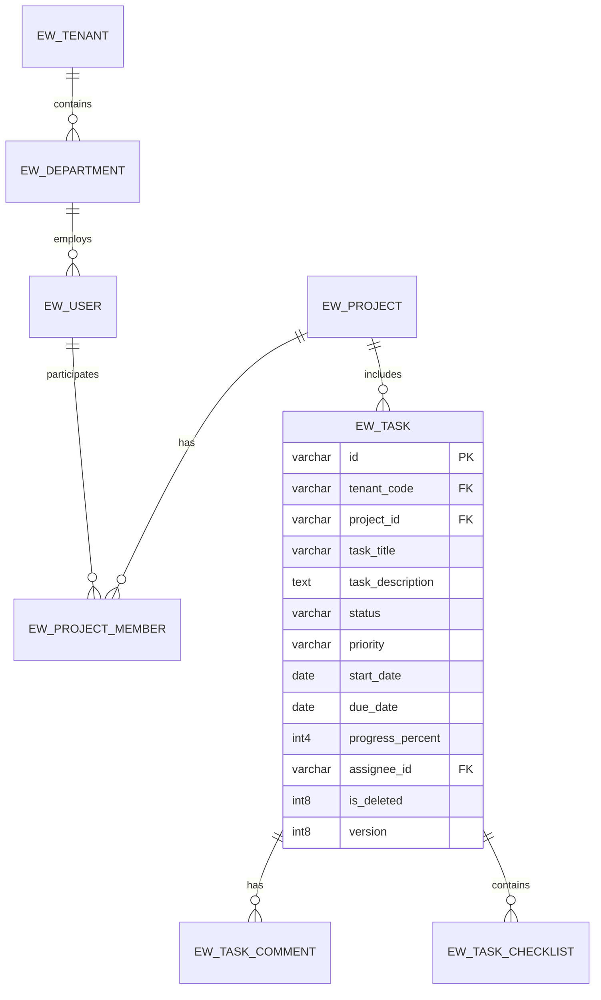

# [TÊN DỰ ÁN] - TÀI LIỆU PHÂN TÍCH THIẾT KẾ CƠ SỞ DỮ LIỆU (PTTK CSDL / DATA DICTIONARY)

## 0. Quản lý tài liệu (Document Control)

| Thông tin | Giá trị |
| :--- | :--- |
| **Tên dự án** | [Tên dự án phần mềm] |
| **Mã hiệu dự án** | [MÃ-DỰ-ÁN] |
| **Mã hiệu tài liệu** | [MÃ-DỰ-ÁN-CSDL] |
| **Hệ quản trị CSDL** | PostgreSQL 15+ / Oracle 19c |
| **Phiên bản** | 1.0 |
| **Ngày ban hành** | YYYY-MM-DD |

### Lịch sử thay đổi (Revision History)

*A: Tạo mới (Add), M: Sửa đổi (Modify), D: Xóa bỏ (Delete)*

| Ngày thay đổi | Vị trí thay đổi | A/M/D | Phiên bản cũ | Phiên bản mới | Mô tả thay đổi | Tác giả |
| :--- | :--- | :---: | :--- | :--- | :--- | :--- |
| YYYY-MM-DD | Toàn bộ | A | - | 1.0 | Thiết kế CSDL ban đầu | [Tên tác giả] |

---

## I. Mô hình Quan hệ Thực thể (Entity Relationship Diagram - ERD)



---

## II. Danh mục Bảng Dữ liệu (Database Table Summary)

| STT | Tên bảng (Physical Name) | Phân hệ (Module) | Mô tả nghiệp vụ | Khối lượng dự kiến (Rows/Year) |
| :--- | :--- | :--- | :--- | :--- |
| 1 | `ew_tenant` | Core | Quản lý thông tin tổ chức / khách hàng đa thuê bao | < 1,000 |
| 2 | `ew_department` | Member | Danh mục cây đơn vị phòng ban | < 10,000 |
| 3 | `ew_user` | Member | Danh sách người dùng hệ thống | < 100,000 |
| 4 | `ew_project` | Project | Thông tin dự án quản lý | < 50,000 |
| 5 | `ew_task` | Task | Thông tin công việc / tác vụ thực hiện | ~ 2,000,000 |
| 6 | `ew_task_comment` | Task | Nhật ký bình luận và thảo luận công việc | ~ 10,000,000 |
| 7 | `ew_audit_log` | System | Nhật ký kiểm toán các thao tác của người dùng | ~ 50,000,000 |

---

## III. Các Trường Kiểm toán Chuẩn Doanh nghiệp (Enterprise Standard Audit Columns)

*Mọi bảng nghiệp vụ trong hệ thống bắt buộc phải tích hợp các trường sau để đảm bảo truy vết kiểm toán, phân vùng đa thuê bao (multi-tenant) và quản lý xung đột dữ liệu (optimistic locking):*

| Tên trường | Kiểu dữ liệu | Size | Nullable | Khóa | Giá trị mặc định | Diễn giải |
| :--- | :--- | :---: | :---: | :---: | :--- | :--- |
| `tenant_code` | varchar | 100 | **Not Null** | Index | N/A | Mã định danh tổ chức / Tenant (Phục vụ multi-tenant) |
| `is_deleted` | int8 / bool | - | **Not Null** | Index | `0` | Đánh dấu xóa mềm (`0`: Active, `1`: Đã xóa) |
| `created_by` | varchar | 100 | **Not Null** | - | N/A | Username người tạo bản ghi |
| `created_date` | timestamp | - | **Not Null** | - | `CURRENT_TIMESTAMP` | Thời điểm tạo bản ghi |
| `last_modified_by` | varchar | 100 | √ | - | NULL | Username người cập nhật cuối cùng |
| `last_modified_date` | timestamp | - | √ | - | NULL | Thời điểm cập nhật cuối cùng |
| `version` | int8 | - | **Not Null** | - | `0` | Phiên bản bản ghi phục vụ Optimistic Locking |

---

## IV. Đặc tả Chi tiết Các Bảng Dữ liệu (Detailed Table Specifications)

### 4.1 Bảng `ew_task` (Quản lý Công việc)
- **Mục đích**: Lưu trữ thông tin chi tiết của từng đầu việc trong dự án hoặc đơn vị.
- **Khóa chính (PK)**: `id` (UUID v4 hoặc Snowflake ID)
- **Khóa ngoại (FK)**: `project_id` references `ew_project(id)`, `assignee_id` references `ew_user(id)`.

| Tên trường | Kiểu dữ liệu | Size | Nullable | Khóa | Mặc định | Ý nghĩa & Quy tắc nghiệp vụ |
| :--- | :--- | :---: | :---: | :---: | :--- | :--- |
| `id` | varchar | 64 | **Not Null** | **PK** | N/A | Khóa chính bản ghi định danh duy nhất |
| `task_code` | varchar | 50 | **Not Null** | **UK** | N/A | Mã công việc định dạng duy nhất (VD: TSK-2026-0001) |
| `project_id` | varchar | 64 | √ | **FK** | NULL | Thuộc dự án nào (NULL nếu là việc đơn vị) |
| `dept_id` | varchar | 64 | **Not Null** | **FK** | N/A | ID đơn vị trực thuộc |
| `task_title` | varchar | 255 | **Not Null** | - | N/A | Tiêu đề công việc |
| `task_description` | text | - | √ | - | NULL | Nội dung mô tả chi tiết công việc |
| `status` | varchar | 30 | **Not Null** | Index | `'TODO'` | Trạng thái: `TODO`, `IN_PROGRESS`, `REVIEW`, `DONE` |
| `priority` | varchar | 20 | **Not Null** | - | `'MEDIUM'`| Mức độ ưu tiên: `LOW`, `MEDIUM`, `HIGH`, `URGENT` |
| `start_date` | date | - | √ | - | NULL | Ngày bắt đầu thực hiện |
| `due_date` | date | - | √ | Index | NULL | Hạn chót hoàn thành |
| `progress_percent` | int4 | - | **Not Null** | - | `0` | Tiến độ hoàn thành (Từ 0 đến 100) |
| `assignee_id` | varchar | 64 | √ | **FK** | NULL | Người chịu trách nhiệm thực hiện chính |
| `reporter_id` | varchar | 64 | **Not Null** | **FK** | N/A | Người giao việc / khởi tạo |
| `tenant_code` | varchar | 100 | **Not Null** | **FK** | N/A | Phân vùng tenant đa khách hàng |
| `is_deleted` | int8 | - | **Not Null** | Index | `0` | Cờ đánh dấu xóa mềm |
| `created_by` | varchar | 100 | **Not Null** | - | N/A | Username người tạo |
| `created_date` | timestamp | - | **Not Null** | - | NOW() | Thời gian tạo |
| `last_modified_by` | varchar | 100 | √ | - | NULL | Username người sửa cuối |
| `last_modified_date` | timestamp | - | √ | - | NULL | Thời gian sửa cuối |
| `version` | int8 | - | **Not Null** | - | `0` | Phiên bản khóa lạc quan (Optimistic Lock) |

---

## V. Chiến lược Đánh Chỉ mục và Phân vùng (Indexing & Partitioning Strategy)

### 5.1 Danh sách Chỉ mục (Indexes)
```sql
-- Đảm bảo duy nhất mã công việc trong cùng một tenant
CREATE UNIQUE INDEX uk_task_code ON ew_task(tenant_code, task_code) WHERE is_deleted = 0;

-- Tối ưu hóa truy vấn danh sách công việc của người dùng theo trạng thái và thời hạn
CREATE INDEX idx_task_assignee_status ON ew_task(tenant_code, assignee_id, status, due_date) WHERE is_deleted = 0;

-- Tối ưu hóa tìm kiếm công việc theo dự án
CREATE INDEX idx_task_project ON ew_task(tenant_code, project_id) WHERE is_deleted = 0;
```

### 5.2 Chiến lược Phân vùng (Partitioning)
- Các bảng lịch sử truy vết như `ew_audit_log` được phân vùng (Partition Range) theo tháng dựa trên cột `created_date` để đảm bảo hiệu năng truy vấn và thuận tiện cho việc lưu trữ dữ liệu cũ (Data Archiving).
