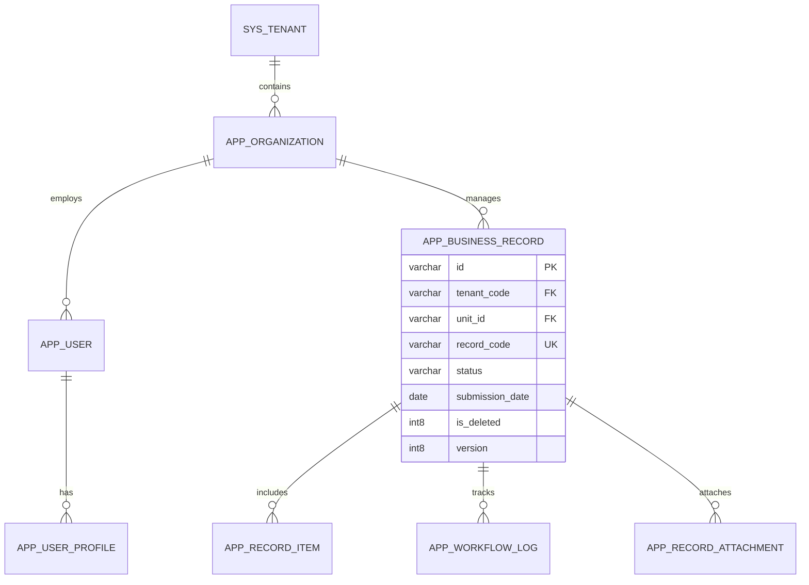

# [TÊN DỰ ÁN] - TÀI LIỆU PHÂN TÍCH THIẾT KẾ CƠ SỞ DỮ LIỆU
*(DATABASE ARCHITECTURE, DATA DICTIONARY & FIELD-LEVEL ENCRYPTION SPECIFICATION)*

## 0. Quản lý tài liệu (Document Control)

| Thông tin | Giá trị |
| :--- | :--- |
| **Tên dự án** | [Tên dự án phần mềm] |
| **Mã hiệu dự án** | [MÃ-DỰ-ÁN] |
| **Mã hiệu tài liệu** | [MÃ-DỰ-ÁN-CSDL] |
| **Hệ quản trị CSDL** | PostgreSQL 15+ / Oracle 19c / SQL Server 2022 |
| **Phiên bản** | 1.0 |
| **Ngày ban hành** | YYYY-MM-DD |

### Lịch sử thay đổi (Revision History)
*A: Tạo mới (Add), M: Sửa đổi (Modify), D: Xóa bỏ (Delete)*

| Ngày thay đổi | Vị trí thay đổi | A/M/D | Phiên bản cũ | Phiên bản mới | Mô tả thay đổi | Tác giả |
| :--- | :--- | :---: | :--- | :--- | :--- | :--- |
| YYYY-MM-DD | Toàn bộ | A | - | 1.0 | Thiết kế CSDL ban đầu | [Tên tác giả] |

---

## I. Mô hình Quan hệ Dữ liệu Tổng thể (Entity Relationship Diagram - ERD)



---

## II. Phân loại và Danh mục Bảng Dữ liệu (Database Table Classification)

Để đảm bảo khả năng bảo trì và tương thích khi nâng cấp nền tảng, toàn bộ cơ sở dữ liệu được phân định thành 4 nhóm rõ ràng:

### 2.1 Bảng tùy biến của hệ thống (Custom System Tables)
*Các bảng nghiệp vụ được thiết kế mới hoàn toàn phục vụ bài toán của dự án:*

| STT | Tên bảng (Physical Name) | Phân hệ (Module) | Mô tả nghiệp vụ | Tăng trưởng dự kiến (Rows/Year) |
| :---: | :--- | :--- | :--- | :--- |
| 1 | `app_business_record` | Core Business | Hồ sơ nghiệp vụ chính của đơn vị | ~ 200,000 |
| 2 | `app_record_item` | Core Business | Chi tiết chỉ tiêu / dòng dữ liệu của hồ sơ | ~ 2,000,000 |
| 3 | `app_workflow_log` | Workflow | Nhật ký chuyển tiếp trạng thái và phê duyệt | ~ 1,000,000 |
| 4 | `app_user_profile` | Identity | Thông tin chi tiết cá nhân (chứa dữ liệu mã hóa) | ~ 50,000 |
| 5 | `app_security_audit_log` | Security | Nhật ký an toàn thông tin và kiểm toán thao tác | ~ 10,000,000 |

### 2.2 Bảng của nền tảng được mở rộng (Extended Platform Tables)
*Các bảng có sẵn từ platform baseline nhưng được bổ sung cột chuyên biệt cho dự án:*

| STT | Tên bảng gốc | Cột bổ sung thêm | Kiểu dữ liệu | Mục đích mở rộng |
| :---: | :--- | :--- | :--- | :--- |
| 1 | `sys_user` | `military_rank_code` | `varchar(50)` | Cấp bậc / danh xưng chuyên môn |
| 2 | `sys_user` | `is_directory_visible`| `int2` (Default 1)| Cờ cho phép hiển thị danh bạ công khai |
| 3 | `sys_organization`| `hierarchy_path` | `varchar(500)`| Đường dẫn cây đơn vị phục vụ lọc phạm vi |

### 2.3 Bảng của nền tảng dùng nguyên trạng (Unmodified Baseline Tables)
*Các bảng dùng trực tiếp từ platform mà không thay đổi cấu trúc:*
- `sys_tenant`: Quản lý thông tin đơn vị thuê bao đa khách hàng.
- `sys_role`, `sys_permission`, `sys_role_permission`: Phân quyền chức năng hệ thống.
- `sys_attachment_blob`: Kho lưu trữ nhị phân tệp đính kèm.

### 2.4 Bảng đã loại bỏ khỏi thiết kế (Eliminated / Deprecated Tables)
*Ghi nhận rõ các bảng đã bị loại bỏ để tránh tình trạng code sót hoặc tái sinh dư thừa:*
- `app_temp_draft_buffer`: *Loại bỏ* - Chuyển sang lưu trữ trực tiếp trên `app_business_record` với trạng thái `DRAFT` kèm cờ `is_deleted` để đơn giản hóa giao dịch.

---

## III. Các Trường Kiểm toán Chuẩn Doanh nghiệp (Enterprise Mandatory Columns)

Mọi bảng tùy biến và mở rộng bắt buộc phải tích hợp đầy đủ 7 trường quản trị sau:

| Tên trường | Kiểu dữ liệu | Size | Nullable | Khóa | Mặc định | Ý nghĩa & Tiêu chuẩn |
| :--- | :--- | :---: | :---: | :---: | :--- | :--- |
| `tenant_code` | varchar | 100 | **Not Null** | Index | N/A | Định danh tổ chức đa thuê bao (Multi-tenant) |
| `is_deleted` | int8 / bool | - | **Not Null** | Index | `0` | Cờ xóa mềm (`0`: Hoạt động, `1`: Đã xóa) |
| `created_by` | varchar | 100 | **Not Null** | - | N/A | Username người tạo bản ghi |
| `created_date` | timestamp | - | **Not Null** | - | `CURRENT_TIMESTAMP` | Thời điểm tạo bản ghi |
| `last_modified_by` | varchar | 100 | √ | - | NULL | Username người cập nhật cuối cùng |
| `last_modified_date`| timestamp | - | √ | - | NULL | Thời điểm cập nhật cuối cùng |
| `version` | int8 | - | **Not Null** | - | `0` | Phiên bản khóa lạc quan (Optimistic Lock) |

---

## IV. Thiết kế Mã hóa Dữ liệu Nhạy cảm (Field-Level Encryption & Blind Index)

Để tuân thủ tiêu chuẩn an toàn thông tin và bảo vệ dữ liệu cá nhân, toàn bộ dữ liệu định danh nhạy cảm (Số định danh CCCD, Số điện thoại cá nhân, Thông tin lương) **tuyệt đối không lưu plaintext** trong CSDL:

```
[Plaintext Input] ──► [AES-256-GCM + Random IV] ──► [Encrypted Column: ciphertext + tag]
                 └──► [HMAC-SHA256 + Secret Salt] ──► [Blind Index Column: hash_index]
```

### 4.1 Đặc tả bảng có trường mã hóa: `app_user_profile`

| Tên trường | Kiểu dữ liệu | Size | Nullable | Khóa | Mặc định | Quy tắc bảo mật & Mã hóa |
| :--- | :--- | :---: | :---: | :---: | :--- | :--- |
| `id` | varchar | 64 | **Not Null** | **PK** | N/A | Khóa chính duy nhất |
| `user_id` | varchar | 64 | **Not Null** | **FK** | N/A | Khóa ngoại trỏ đến `sys_user(id)` |
| `unit_id` | varchar | 64 | **Not Null** | Index | N/A | Đơn vị trực thuộc phục vụ lọc dữ liệu |
| `national_id_plaintext` | varchar | 20 | √ | - | NULL | **BẮT BUỘC RỖNG HOẶC LOẠI BỎ** |
| `national_id_cipher` | bytea / blob | - | √ | - | NULL | Bản mã số định danh cá nhân (AES-256-GCM) |
| `national_id_hash` | varchar | 64 | √ | Index | NULL | Blind Index (HMAC-SHA256) phục vụ tìm kiếm chính xác |
| `phone_cipher` | bytea / blob | - | √ | - | NULL | Bản mã số điện thoại liên hệ (AES-256-GCM) |
| `phone_hash` | varchar | 64 | √ | Index | NULL | Blind Index phục vụ tra cứu số điện thoại |
| `key_version` | int4 | - | **Not Null** | - | `1` | Phiên bản khóa mã hóa (Hỗ trợ Key Rotation) |
| `tenant_code` | varchar | 100 | **Not Null** | - | N/A | Mã thuê bao |
| `is_deleted` | int8 | - | **Not Null** | Index | `0` | Cờ xóa mềm |
| `created_by` | varchar | 100 | **Not Null** | - | N/A | Người tạo |
| `created_date` | timestamp | - | **Not Null** | - | NOW() | Ngày tạo |
| `version` | int8 | - | **Not Null** | - | `0` | Optimistic Lock |

### 4.2 Hệ quả vận hành cần lưu ý (Operational Consequences)
1. **Không hỗ trợ tìm kiếm mờ (Wildcard / LIKE `%value%`)**: Do chỉ tạo blind index băm một chiều cho chuỗi chính xác, hệ thống chỉ hỗ trợ tìm kiếm bằng tuyệt đối (`WHERE national_id_hash = ?`).
2. **Quy trình Đổi khóa (Key Rotation)**: Khi nâng cấp khóa mã hóa (`key_version = 2`), ứng dụng cần kích hoạt background job đọc từng bản mã cũ với khóa v1, giải mã, mã hóa lại bằng khóa v2 và cập nhật lại `key_version`.

---

## V. Chiến lược Chỉ mục và Hiệu năng (Indexing Strategy)

```sql
-- Chỉ mục duy nhất mã hồ sơ theo từng đơn vị và tenant (bỏ qua bản ghi đã xóa)
CREATE UNIQUE INDEX uk_record_code ON app_business_record(tenant_code, unit_id, record_code) 
WHERE is_deleted = 0;

-- Tối ưu truy vấn phân trang danh sách theo đơn vị, trạng thái và ngày nộp
CREATE INDEX idx_record_scope_status ON app_business_record(tenant_code, unit_id, status, submission_date DESC) 
WHERE is_deleted = 0;

-- Tìm kiếm chính xác hồ sơ qua blind index định danh cá nhân
CREATE INDEX idx_profile_national_id_hash ON app_user_profile(tenant_code, national_id_hash) 
WHERE is_deleted = 0;
```

---

## VI. Ước lượng Quy mô Dữ liệu và Ngưỡng Cảnh báo (Capacity Sizing & Scaling Thresholds)

### 6.1 Quy mô nền tại thời điểm bàn giao (Baseline Size)
- Tổng số đơn vị cây tổ chức: ~ 500 đơn vị.
- Tổng số tài khoản người dùng: ~ 5,000 tài khoản.
- Dung lượng khởi tạo ban đầu: ~ 2 GB CSDL.

### 6.2 Công thức ước lượng nhóm dữ liệu tăng nhanh nhất
Nhóm bảng chi tiết nghiệp vụ (`app_record_item`) và nhật ký kiểm toán (`app_security_audit_log`):
$$\text{Dung lượng/năm} = N_{\text{bản ghi/kỳ}} \times S_{\text{kỳ/năm}} \times \text{Kích thước trung bình/dòng (bytes)} \times 1.4 \ (\text{Chỉ mục})$$
- Dự kiến sinh thêm: ~ 15 GB - 25 GB dữ liệu thuần/năm.

### 6.3 Ngưỡng cần xem xét lại thiết kế kiến trúc (Re-Architecture Thresholds)
- **Khi một bảng vượt quá 10.000.000 dòng hoặc dung lượng > 50 GB**: Bắt buộc kích hoạt giải pháp phân vùng bảng (Table Partitioning) theo năm/tháng.
- **Khi dung lượng lưu trữ CSDL tổng thể vượt quá 500 GB**: Chuyển các bảng audit log và lịch sử trạng thái sang CSDL thứ cấp (Cold Storage / Time-series DB / Data Lake).
