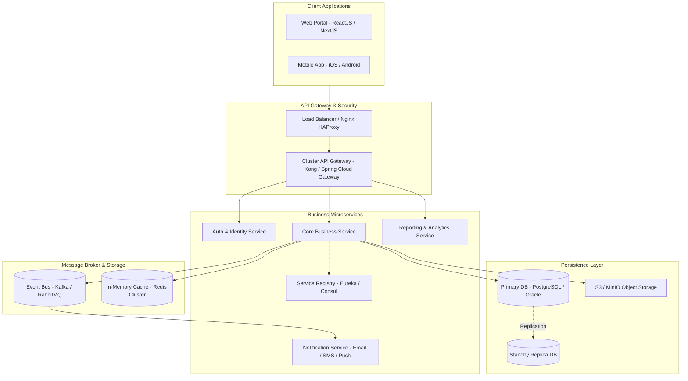
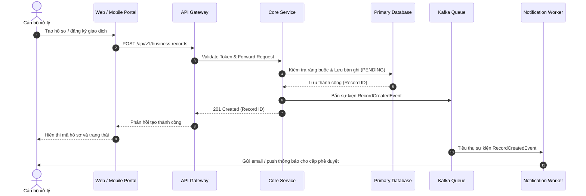

# [TÊN DỰ ÁN] - TÀI LIỆU THIẾT KẾ HỆ THỐNG TỔNG THỂ (HIGH-LEVEL DESIGN - HLD)

## 0. Quản lý tài liệu (Document Control)

| Thông tin | Giá trị |
| :--- | :--- |
| **Tên dự án** | [Tên dự án phần mềm] |
| **Mã hiệu dự án** | [MÃ-DỰ-ÁN] |
| **Mã hiệu tài liệu** | [MÃ-DỰ-ÁN-HLD] |
| **Phiên bản** | 1.0 |
| **Ngày ban hành** | YYYY-MM-DD |

### Lịch sử thay đổi (Revision History)

| Ngày thay đổi | Phiên bản cũ | Phiên bản mới | Vị trí thay đổi | Lý do / Mô tả thay đổi | Tác giả |
| :--- | :--- | :--- | :--- | :--- | :--- |
| YYYY-MM-DD | - | 1.0 | Toàn bộ | Thiết kế kiến trúc tổng thể ban đầu | [Tên tác giả] |

### Trang ký duyệt (Sign-off)

| Họ và tên | Chức vụ | Đơn vị / Bộ phận | Chữ ký | Ngày |
| :--- | :--- | :--- | :--- | :--- |
| [Họ tên 1] | Solution Architect | Enterprise Architecture Team | | |
| [Họ tên 2] | Technical Lead | Core Engineering Team | | |
| [Họ tên 3] | Head of Infrastructure / DevOps | IT Operations | | |

---

## I. Giới thiệu (Introduction)

### 1.1 Mục đích tài liệu (Purpose)
Cung cấp cái nhìn tổng thể về kiến trúc hệ thống, các phân hệ thành phần, mô hình phân bố dịch vụ, yêu cầu hạ tầng kỹ thuật và giải pháp tích hợp làm cơ sở cho thiết kế chi tiết (LLD) và triển khai thực tế.

### 1.2 Căn cứ xây dựng (References)
- Tài liệu Phân tích yêu cầu người sử dụng (URD / SRS) đã được phê duyệt.
- Tiêu chuẩn kiến trúc công nghệ và chính sách bảo mật thông tin nội bộ.

### 1.3 Thuật ngữ và từ viết tắt (Glossary)

| Thuật ngữ | Diễn giải |
| :--- | :--- |
| API Gateway | Điểm tiếp nhận, định tuyến và xác thực tập trung |
| Registry Service | Dịch vụ đăng ký và phát hiện địa chỉ động của các microservice |
| HA / Active-Active | Kiến trúc sẵn sàng cao đa máy chủ hoạt động song song |
| Active-Standby | Mô hình máy chủ chính chạy, máy chủ dự phòng đồng bộ |

---

## II. Kiến trúc tổng thể (Architecture Overview)

### 2.1 Mô hình kiến trúc tổng quan (Overall System Architecture)

### 2.2 Mô hình logic phân tầng (Logical Tier Decomposition)
- **Tầng giao diện (Presentation Tier)**: Ứng dụng Web SPA và Mobile native giao tiếp hoàn toàn qua RESTful APIs/gRPC có mã hóa TLS.
- **Tầng cổng giao tiếp (Gateway & Ingress Tier)**: Định tuyến yêu cầu, kiểm tra rate-limiting, phân giải JWT token, gắn headers định danh nội bộ.
- **Tầng xử lý nghiệp vụ (Application / Service Tier)**: Các dịch vụ độc lập theo nghiệp vụ (Domain-Driven Design), không gọi chéo trực tiếp database của nhau.
- **Tầng tích hợp & bất đồng bộ (Integration Tier)**: Hàng đợi thông điệp phục vụ tác vụ nền, đồng bộ dữ liệu phi tập trung và gửi thông báo.
- **Tầng dữ liệu (Persistence Tier)**: CSDL quan hệ chính có cấu hình Replicas, kết hợp Redis caching giảm tải truy vấn đọc.

### 2.3 Mô hình Phân quyền theo Phạm vi Dữ liệu (Data Scope RBAC Model)

Hệ thống triển khai kiểm soát dữ liệu đa phân cấp theo ma trận 4 phạm vi $\times$ 2 lớp kiểm soát:

#### Bốn phạm vi tài khoản (Account Scopes)
1. **Phạm vi 1 - Toàn hệ thống (Global / Headquarters)**: Truy cập, cấu hình và tổng hợp số liệu của toàn bộ các đơn vị trong tổ chức.
2. **Phạm vi 2 - Cấp đơn vị quản lý (Managing Division / Unit)**: Quản lý nghiệp vụ nội bộ và xem, phê duyệt, tổng hợp số liệu từ toàn bộ các đơn vị trực thuộc cấp dưới.
3. **Phạm vi 3 - Cấp đơn vị trực thuộc (Subordinate Unit / Branch)**: Chỉ xem, khởi tạo và quản lý dữ liệu thuộc phạm vi đơn vị của chính mình.
4. **Phạm vi 4 - Người dùng cơ sở / Cá nhân (Base User / Self)**: Chỉ xem dữ liệu cá nhân của chính mình hoặc dữ liệu công khai chung.

#### Hai lớp kiểm soát độc lập (Enforcement Layers)
- **Lớp 1 - Route & Action Guard (UI Tier)**: Ẩn/hiện menu, nút bấm thao tác và chặn điều hướng trực tiếp trên Frontend dựa trên vai trò và phạm vi gán cho phiên người dùng.
- **Lớp 2 - Service & Data Scope Filter (API Tier - Bắt buộc)**: Tầng Business Service và Data Access Layer tự động inject điều kiện lọc `unit_id IN (...)` vào mọi câu lệnh truy vấn SQL. **Tuyệt đối cấm tin tưởng tham số `unit_id` do client truyền lên**; tham số phạm vi phải được phân giải trực tiếp từ JWT/Identity context của phiên đăng nhập.

---

## III. Cấu hình và Môi trường triển khai (Infrastructure & Deployment)

### 3.1 Mô hình dự phòng sẵn sàng cao (High Availability Topology)
- **Cluster Gateway**: Cài đặt theo mô hình Active - Active, cân bằng tải tự động.
- **Cluster Application Servers**: Tối thiểu 2 instances cho mỗi microservice, cơ chế tự động chuyển đổi khi có sự cố.
- **Cluster Database**: Thiết lập Active - Standby đồng bộ dữ liệu thời gian thực (Streaming Replication).

### 3.2 Yêu cầu phần cứng tối thiểu (Hardware Sizing)

| STT | Phân nhóm máy chủ | Số lượng | Cấu hình tối thiểu (Mỗi server) | Mục đích sử dụng |
| :--- | :--- | :--- | :--- | :--- |
| 1 | Cụm API Gateway & Web | 2 | CPU: 8 Cores, RAM: 16 GB, SSD: 200 GB | Tiếp nhận request và phục vụ static web |
| 2 | Cụm Business Services | 3 | CPU: 16 Cores, RAM: 32 GB, SSD: 500 GB | Chạy các container nghiệp vụ core |
| 3 | Cụm Database (Active/Standby) | 2 | CPU: 16 Cores, RAM: 64 GB, NVMe: 1 TB | Lưu trữ dữ liệu quan hệ chính |
| 4 | Cụm Cache & Message Broker | 3 | CPU: 8 Cores, RAM: 32 GB, SSD: 300 GB | Cụm Redis và Kafka phân tán |

### 3.3 Yêu cầu phần mềm và công nghệ (Technology Stack)
- **Hệ điều hành**: Linux Enterprise (RHEL 8+ / Rocky Linux / Ubuntu Server 22.04 LTS).
- **Backend Framework**: Java 17 / 21 LTS (Spring Boot 3.x) hoặc Go / Node.js LTS.
- **Frontend Framework**: React 18+ / TypeScript / TailwindCSS.
- **Cơ sở dữ liệu**: PostgreSQL 15+ / Oracle Database 19c.
- **Ảo hóa & Đóng gói**: Docker Engine, Kubernetes / Docker Compose.

### 3.4 Chỉ tiêu KPI hệ thống (System SLA & Performance Metrics)

#### Chỉ tiêu máy chủ (Server KPIs)
| Tiêu chí | Ngưỡng cảnh báo | Ngưỡng tới hạn | Hành động xử lý |
| :--- | :--- | :--- | :--- |
| **CPU Utilization** | > 70% | > 85% kéo dài 5 phút | Tự động scale-out pod hoặc nâng cấp tài nguyên |
| **RAM Utilization** | > 75% | > 85% | Khởi động lại dịch vụ rò rỉ bộ nhớ, kiểm tra heap dump |
| **Disk Space Usage** | > 80% | > 90% | Định kỳ dọn dẹp log, archive dữ liệu cũ sang kho lưu trữ |

#### Chỉ tiêu dịch vụ (Service KPIs)
| Tiêu chí | Mục tiêu chất lượng | Phương thức đo lường |
| :--- | :--- | :--- |
| **Thời gian phản hồi (Latency)** | < 1000ms cho 95% request | APM Agent (Prometheus / Dynatrace) |
| **Tỷ lệ truy vấn CSDL thành công** | >= 99.95% | Thống kê connection pool và slow query log |
| **Thời gian lưu trữ log nghiệp vụ** | Tối thiểu 180 ngày | Centralized Log (Elasticsearch / OpenSearch) |
| **Tính sẵn sàng tổng thể (Uptime)**| 99.9% (Tối đa 43.8 phút downtime/tháng) | Uptime Robot / Healthcheck probe |

---

## IV. Phân hệ và Luồng nghiệp vụ chính (Business Workflows)

### 4.1 Danh sách phân hệ chức năng
1. **Phân hệ Quản trị hệ thống (System Administration)**: Quản lý người dùng, nhóm quyền, đồng bộ danh mục tổ chức.
2. **Phân hệ Xử lý nghiệp vụ chính (Core Business Processing)**: Đăng ký, phê duyệt, xử lý tác vụ theo quy trình.
3. **Phân hệ Tương tác & Thông báo (Collaboration & Notifications)**: Chat, bình luận, email/SMS/app push notifications.
4. **Phân hệ Báo cáo & Thống kê (Reporting & Analytics)**: Tổng hợp số liệu, xuất file Excel/PDF, biểu đồ dashboard.

### 4.2 Luồng xử lý nghiệp vụ xuyên suốt (End-to-End Workflow)

### 4.3 Đường đi của một yêu cầu & Bốn điểm cần giữ khi bảo trì (Request Journey & Maintenance Invariants)

#### Bảy bước xử lý của một yêu cầu (7-Step Journey)
1. **Bước 1 - Dispatch UI**: Người dùng gửi yêu cầu từ Web Portal; Client đính kèm JWT Token vào Header `Authorization`.
2. **Bước 2 - Reverse Proxy & Gateway**: API Gateway kiểm tra TLS, rate limit, giải mã chữ ký JWT và gắn headers nhận dạng nội bộ (`X-User-Id`, `X-Tenant-Code`, `X-Unit-Id`).
3. **Bước 3 - Routing Controller**: Controller tầng ứng dụng nhận DTO, thực thi schema validation (ràng buộc dữ liệu đầu vào).
4. **Bước 4 - Scope & Permission Guard**: Interceptor đối chiếu quyền hạn thao tác và phân giải phạm vi dữ liệu được phép xử lý.
5. **Bước 5 - Domain Service Execution**: Thực thi business rules, tính toán nghiệp vụ, kiểm tra trạng thái hợp lệ và máy trạng thái (State Machine).
6. **Bước 6 - Data Persistence & ORM**: Thực thi câu lệnh SQL có gán bắt buộc điều kiện tenant/unit scope; mã hóa trường nhạy cảm trước khi lưu.
7. **Bước 7 - Audit Log & Event Publishing**: Ghi nhận bản ghi `SecurityAuditLog` đồng thời bắn sự kiện vào Message Broker để xử lý các tác vụ nền.

#### Bốn điểm bất biến cần giữ khi bảo trì (4 Maintenance Invariants)
1. **Bất biến 1 - Không bypass Data Scope tại Repository**: Mọi hàm truy vấn danh sách hoặc chi tiết bản ghi bắt buộc nhận `tenant_code` và `unit_scope` làm điều kiện `WHERE`. Cấm tuyệt đối viết câu lệnh chỉ lọc theo `id` đơn thuần.
2. **Bất biến 2 - Tuyệt đối không log Plaintext dữ liệu nhạy cảm**: Log hệ thống (Kibana/Console/File) tuyệt đối không in số định danh cá nhân, mật khẩu, access token hoặc chuỗi byte giải mã.
3. **Bất biến 3 - Chuyển trạng thái phải kiểm tra trạng thái nguồn**: Mọi lệnh cập nhật trạng thái (State Transition) phải xác nhận trạng thái hiện tại trong CSDL khớp với luồng hợp lệ trước khi chuyển trạng thái mới (chống race condition và thao tác trái luồng).
4. **Bất biến 4 - Kiểm toán gắn liền giao dịch (Transactional Audit)**: Mọi thao tác thay đổi dữ liệu trọng yếu phải ghi vết kiểm toán thành công hoặc rollback toàn bộ giao dịch nếu ghi log thất bại.

---

## V. Giải pháp Bảo mật và Phục hồi sau thảm họa (Security & Disaster Recovery)

### 5.1 Kiến trúc an toàn bảo mật
- **Bảo mật mạng (Network Security)**: Tách biệt phân vùng mạng DMZ (chứa Ingress/Gateway) và Intranet (chứa DB và Core microservices).
- **Mã hóa (Encryption)**: Toàn bộ kết nối sử dụng HTTPS/TLS 1.3; các trường dữ liệu nhạy cảm (CCCD, Số tài khoản, Mật khẩu) được mã hóa AES-256 trước khi ghi vào CSDL.
- **Xác thực và Phân quyền**: Phân quyền chi tiết theo vai trò (RBAC) và theo đơn vị quản lý dữ liệu (Data Scope).

### 5.2 Kiến trúc sao lưu và phục hồi thảm họa (Disaster Recovery - DR)
- **RPO (Recovery Point Objective)**: < 15 phút (mất mát tối đa 15 phút dữ liệu).
- **RTO (Recovery Time Objective)**: < 60 phút (khôi phục hệ thống trong vòng 1 giờ).
- **Quy trình kiểm tra định kỳ**: Diễn tập chuyển đổi sang Site dự phòng (DR drill) tối thiểu 06 tháng một lần.
