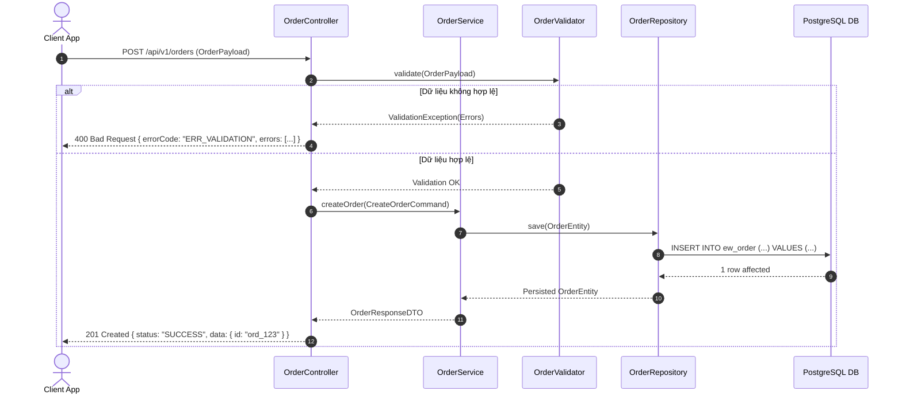
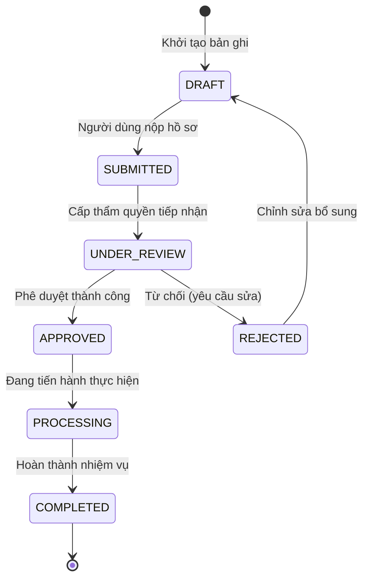

# [TÊN DỰ ÁN] - TÀI LIỆU THIẾT KẾ HỆ THỐNG CHI TIẾT & ĐẶC TẢ API (LLD & API SPECIFICATION)

## 0. Quản lý tài liệu (Document Control)

| Thông tin | Giá trị |
| :--- | :--- |
| **Tên dự án** | [Tên dự án phần mềm] |
| **Mã hiệu dự án** | [MÃ-DỰ-ÁN] |
| **Mã hiệu tài liệu** | [MÃ-DỰ-ÁN-LLD] |
| **Phiên bản** | 1.0 |
| **Ngày ban hành** | YYYY-MM-DD |

### Lịch sử thay đổi (Revision History)

| Ngày thay đổi | Phiên bản | Vị trí thay đổi | Mô tả thay đổi | Tác giả |
| :--- | :--- | :--- | :--- | :--- |
| YYYY-MM-DD | 1.0 | Toàn bộ | Thiết kế chi tiết thành phần và hợp đồng API | [Tên tác giả] |

---

## I. Thiết kế Chi tiết Thành phần (Component Design)

### 1.1 Cấu trúc Module và Phân tầng Mã nguồn (Package Structure)
```
src/
├── domain/             # Entities, Value Objects, Domain Events
├── application/        # Use Cases, Command/Query Handlers, DTOs
├── infrastructure/     # Database Repositories, Message Producers, Third-party Clients
└── presentation/       # REST Controllers, Middleware, Request/Response Mappers
```

### 1.2 Biểu đồ tuần tự chi tiết (Detailed Sequence Diagram)



### 1.3 Máy trạng thái vòng đời (State Machine Lifecycle)



---

## II. Đặc tả Hợp đồng API Chuẩn Doanh nghiệp (Enterprise API Specification)

*Định dạng bảng đặc tả chuẩn ngân hàng (Mẫu LPBank / Viễn thông)*

### API 01: [Tên API ngắn gọn, ví dụ: Lấy Token xác thực]

| Nhóm / Group | **Xác thực & Phân quyền (Auth)** |
| :--- | :--- |
| **Method** | `POST` |
| **Endpoint** | `/api/v1/auth/token` |
| **Base URL** | `https://api.domain.com` |
| **Mục đích / Ghi chú** | Cấp phát Access Token (JWT) theo chuẩn OAuth2 Client Credentials hoặc Password Grant. Token đính kèm vào Authorization header khi gọi các API khác. |

#### 1. Request Headers

| Type | Param / Key | Kiểu DL | Bắt buộc | Diễn giải | Giá trị ví dụ | Ghi chú |
| :--- | :--- | :--- | :---: | :--- | :--- | :--- |
| Header | `Content-Type` | String | **M** | Định dạng dữ liệu gửi lên | `application/json` | Bắt buộc `application/json` |
| Header | `X-Request-ID` | String | **M** | Mã định danh duy nhất của request phục vụ tracing | `f47ac10b-58cc-4372-a567-0e02b2c3d479` | Chuẩn UUID v4 |
| Header | `X-Client-Timestamp` | Number | **M** | Timestamp gửi yêu cầu (Epoch ms) | `1727256000000` | Ngăn chặn replay attack |

*(M: Mandatory - Bắt buộc; O: Optional - Không bắt buộc)*

#### 2. Request Body / Query Parameters

| Type | Param / Key | Kiểu DL | Bắt buộc | Diễn giải | Giá trị ví dụ | Quy tắc kiểm tra (Validation) |
| :--- | :--- | :--- | :---: | :--- | :--- | :--- |
| Body | `username` | String | **M** | Tên đăng nhập của tài khoản | `admin_system` | 5 - 50 ký tự, không chứa ký tự đặc biệt |
| Body | `password` | String | **M** | Mật khẩu đã mã hóa Base64/Hash | `U2FsdGVkX1+...` | Bắt buộc |
| Body | `grant_type` | String | **M** | Phương thức xác thực | `password` | Nhận giá trị: `password`, `refresh_token` |
| Body | `device_info.device_id` | String | **O** | Định danh thiết bị | `IMEI_864201938` | Tối đa 100 ký tự |

#### 3. Ví dụ cURL (Request Sample)
```bash
curl -X POST "https://api.domain.com/api/v1/auth/token" \
  -H "Content-Type: application/json" \
  -H "X-Request-ID: f47ac10b-58cc-4372-a567-0e02b2c3d479" \
  -H "X-Client-Timestamp: 1727256000000" \
  -d '{
    "username": "admin_system",
    "password": "EncryptedPasswordString==",
    "grant_type": "password",
    "device_info": {
      "device_id": "IMEI_864201938"
    }
  }'
```

#### 4. Response Headers

| Type | Param / Key | Kiểu DL | Bắt buộc | Diễn giải | Giá trị ví dụ |
| :--- | :--- | :--- | :---: | :--- | :--- |
| Header | `Content-Type` | String | **M** | Định dạng phản hồi | `application/json; charset=UTF-8` |
| Header | `X-Response-Time` | Number | **M** | Thời gian xử lý tại máy chủ (ms) | `45` |

#### 5. Response Body Fields

| Type | Param / Key | Kiểu DL | Bắt buộc | Diễn giải | Giá trị ví dụ |
| :--- | :--- | :--- | :---: | :--- | :--- |
| Body | `status` | String | **M** | Trạng thái tổng quát của response | `SUCCESS` hoặc `ERROR` |
| Body | `code` | String | **M** | Mã phản hồi chuẩn hệ thống | `200` (hoặc mã lỗi như `AUTH_001`) |
| Body | `message` | String | **M** | Thông điệp thông báo | `Thao tác thành công` |
| Body | `data.access_token` | String | **M** | Chuỗi JWT Token dùng để xác thực | `eyJhbGciOi...` |
| Body | `data.token_type` | String | **M** | Loại token | `Bearer` |
| Body | `data.expires_in` | Number | **M** | Thời hạn hiệu lực tính bằng giây | `3600` |
| Body | `data.refresh_token`| String | **M** | Token dùng để làm mới session | `ref_892347bc...` |

#### 6. Phản hồi Mẫu (JSON Payloads)

##### Phản hồi Thành công (HTTP 200 OK)
```json
{
  "status": "SUCCESS",
  "code": "200",
  "message": "Cấp phát token thành công",
  "data": {
    "access_token": "eyJhbGciOiJSUzI1NiIsInR5cCI6IkpXVCJ9.eyJzdWIiOiJhZG1pbl9zeXN0ZW0iLCJyb2xlcyI6WyJBRE1JTiJdLCJleHAiOjE3Mjc2ODgwMDB9...",
    "token_type": "Bearer",
    "expires_in": 3600,
    "refresh_token": "ref_9f2a7b8e1c3d4e5f6a7b8c9d0e1f2a3b",
    "scope": "read write admin"
  },
  "timestamp": 1727256000045
}
```

##### Phản hồi Thất bại (HTTP 401 Unauthorized / 400 Bad Request)
```json
{
  "status": "ERROR",
  "code": "AUTH_INVALID_CREDENTIALS",
  "message": "Tên đăng nhập hoặc mật khẩu không chính xác",
  "errors": [
    {
      "field": "password",
      "code": "VAL_PWD_MISMATCH",
      "message": "Mật khẩu xác thực không đúng"
    }
  ],
  "timestamp": 1727256000020
}
```

---

## III. Bảng Danh mục Mã lỗi Hệ thống (Error Code Dictionary)

| Mã lỗi (Error Code) | HTTP Status | Thông điệp hiển thị người dùng | Nguyên nhân kỹ thuật | Hướng khắc phục |
| :--- | :---: | :--- | :--- | :--- |
| `SUCCESS` | 200 / 201 | Thao tác thành công | Thực hiện hoàn tất | Không |
| `ERR_REQ_VALIDATION` | 400 | Dữ liệu đầu vào không hợp lệ | Thiếu trường hoặc sai format | Kiểm tra lại bảng tham số |
| `AUTH_UNAUTHORIZED` | 401 | Phiên làm việc đã hết hạn | Token thiếu, hết hạn hoặc sai chữ ký | Làm mới token hoặc đăng nhập lại |
| `AUTH_FORBIDDEN` | 403 | Bạn không có quyền thực hiện thao tác này | Tài khoản không có permission tương ứng | Liên hệ quản trị viên cấp quyền |
| `SYS_INTERNAL_ERROR` | 500 | Hệ thống đang bận, vui lòng thử lại sau | Ngoại lệ chưa kiểm soát hoặc sập DB | Kiểm tra log máy chủ |
