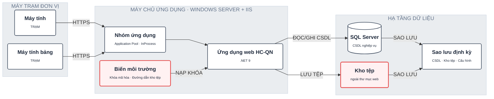
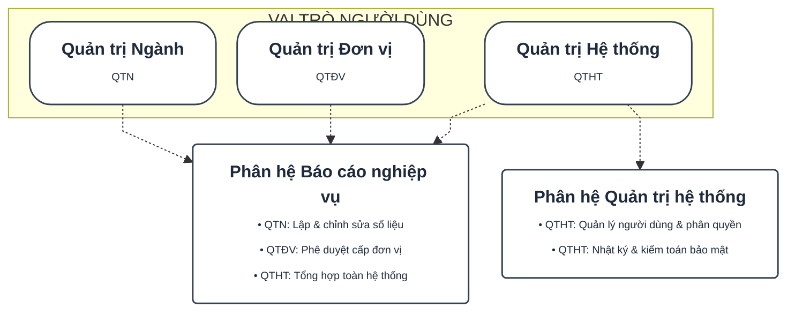
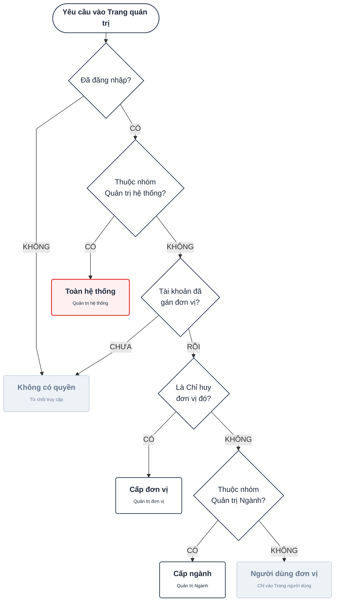
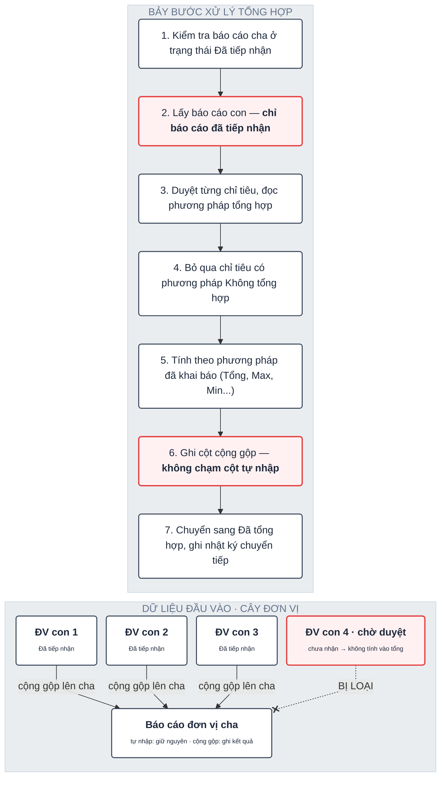
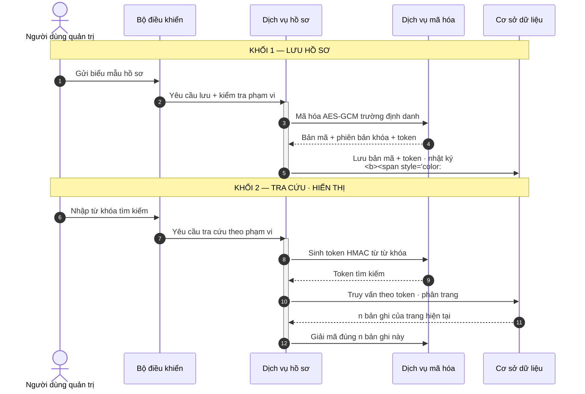

# Enterprise Diagram Archetypes & Replication Guide

Design system tokens, archetype clustering, and replication templates extracted from the 20 enterprise system design diagrams (`TL1_PHAN_TICH_THIET_KE_HE_THONG_assets`).

---

## 1. Asset Catalog & Archetype Deduplication

The 20 source diagrams cluster into **9 distinct structural archetypes**:

| Archetype | Description | Source Assets (Deduplicated) | Primary Purpose |
|---|---|---|---|
| **1. Deployment & Infrastructure Topology** | Multi-zone physical/network deployment, server roles, databases, backup nodes | `Image 0`, `Image 14` | Physical architecture, security perimeter, hosting tiers |
| **2. Functional Decomposition / WBS Tree** | System root with 1-to-N bus bar distributing into subsystem cards with bullet lists | `Image 1` | Module breakdown, scope definition, feature tree |
| **3. Role-Based Access Matrix (RBAC)** | Top actor row with dashed drops into subsystem cards with role badges | `Image 2` | Authorization mapping, user privileges, access scope |
| **4. Vertical Decision Spine Flowchart** | Central vertical diamond spine, left rejection error bus, right branch targets | `Image 3`, `Image 13` | Authentication, gatekeeping, multi-step routing |
| **5. Snake / S-Curve Process Pipeline** | 2–3 horizontal zigzag rows (Băng 1, 2, 3), security checkpoints, rejection buses | `Image 4`, `Image 7`, `Image 9`, `Image 11`, `Image 15` | Multi-step workflows, transaction processing, input validation |
| **6. State Machine & Approval Lifecycle** | Dual-track lifecycle (10–50 + toggle inhibitors) & multi-tier approval with return lanes | `Image 5`, `Image 10`, `Image 17` | Document status, period management, administrative hierarchy |
| **7. Dual-Pane Input Hierarchy + Algorithm** | Left pane: Unit tree with exclusion marker; Right pane: 7 numbered algorithm steps | `Image 6`, `Image 16` | Data aggregation logic, batch processing, calculation rules |
| **8. Conceptual Data Model / ERD Matrix** | 2x4 Entity grid, `# Id`, `-> FK`, physical vs logical relations, cascade paths | `Image 8`, `Image 19` | High-level data architecture, entity relationships, security encryption |
| **9. Logical Software Architecture Stack** | Stacked 4-layer containers (UI, Subsystems, Core, DAL) pointing to DB cylinders | `Image 12` | Software layers, dependency direction, core services |
| **10. Partitioned Enterprise Sequence** | UML sequence with functional scenario blocks (Khối 1, 2), crypto highlight arrows | `Image 18` | Security handshake, data encryption, search queries |

---

## 2. Unified Enterprise Design System Tokens

All 20 diagrams adhere strictly to the following styling tokens:

### A. Color Palette
```yaml
canvas:
  background: "#f4f6f8"      # Slate canvas background
text:
  primary: "#1e293b"         # Slate-900: Titles, headings, main labels
  secondary: "#64748b"       # Slate-500: Subtitles, kicker headers, meta info
  highlight: "#e53e3e"       # Red-600: Critical security text, focus titles
cards:
  default_fill: "#ffffff"    # Pure white card background
  default_stroke: "#334155"  # Slate-700: 1.5px standard border
  focus_fill: "#fff1f2"      # Rose-50: Critical/focus card fill
  focus_stroke: "#e53e3e"    # Red-600: 2px highlight border
  pending_fill: "#fef3c7"    # Amber-100: Waiting/return states
  pending_stroke: "#d97706"  # Amber-600: Pending border
  rejected_fill: "#edf2f7"   # Slate-100: Inactive, rejected, disabled cards
  rejected_stroke: "#cbd5e1" # Slate-300: Muted borders
containers:
  zone_fill: "#eaedf0"       # Subtle gray/slate for outer zones / swimlanes
  zone_stroke: "#cbd5e1"     # Slate-300 for zone borders
  net_boundary: "#e53e3e"    # Red dashed border for military network boundary
```

### B. Typography & Shape Rules
* **Kicker Headers:** Monospace uppercase with letter-spacing (e.g., `BĂNG 1 · TIẾP NHẬN`, `TẦNG 3 · TIÊU ĐIỂM`).
* **Title + Subtitle:** Title in bold 13–14px, subtitle in muted 10–11px beneath (`Title<br/><span style='font-size:11px;color:#64748b;'>subtitle</span>`).
* **Node Shapes:**
  * Process / Action / Module: Rounded rect (`rx: 4..6px`).
  * Actor / Terminal / Start-End: Pill shape (`rx: 20..26px`).
  * Decision: Diamond (`{...}`) - kept compact (max 2 lines).
  * Storage / Database: Cylinder shape (`[(...)]`).
  * Inhibitor / Blocked Action: Dashed line with `X` cross mark (`--X--`).

### C. Standard Footer Legend Template
Every diagram embeds an anchored legend at the bottom using an HTML table with inline vector shapes:

```mermaid
classDef transparentNode fill:transparent,stroke:none;
LEGEND["<div style='width:880px; border-top:1px solid #cbd5e1; padding-top:10px; margin-top:12px;'>
  <table style='margin:0 auto; border-spacing:22px 0; font-size:11px; font-family:sans-serif; color:#475569;'>
    <tr style='white-space:nowrap;'>
      <td><span style='font-weight:700; color:#1e293b;'>CHÚ GIẢI</span></td>
      <td><svg width='24' height='12' style='vertical-align:middle;'><rect x='1' y='1' width='22' height='10' rx='3' style='fill:#fff; stroke:#334155; stroke-width:1.5px;'/></svg> Bước xử lý / Thường</td>
      <td><svg width='24' height='12' style='vertical-align:middle;'><rect x='1' y='1' width='22' height='10' rx='3' style='fill:#fff1f2; stroke:#e53e3e; stroke-width:2px;'/></svg> Tiêu điểm bảo mật / Trọng tâm</td>
      <td><svg width='24' height='12' style='vertical-align:middle;'><rect x='1' y='1' width='22' height='10' rx='3' style='fill:#fef3c7; stroke:#d97706; stroke-width:1.5px;'/></svg> Chờ duyệt / Bị trả lại</td>
      <td><svg width='24' height='12' style='vertical-align:middle;'><rect x='1' y='1' width='22' height='10' rx='3' style='fill:#edf2f7; stroke:#cbd5e1; stroke-width:1.5px;'/></svg> Từ chối / Vô hiệu</td>
      <td><svg width='30' height='12' style='vertical-align:middle;'><line x1='0' y1='6' x2='24' y2='6' stroke='#e53e3e' stroke-width='1.5' stroke-dasharray='4,3'/><text x='12' y='9' font-size='10' fill='#e53e3e' text-anchor='middle'>✕</text></svg> Bị chặn</td>
    </tr>
  </table>
</div>"]:::transparentNode
```

---

## 3. Archetype Replication Blueprints & Code Templates

### Archetype 1: Physical Deployment & Network Zones (Assets 0, 14)
**Pattern:** Subgraphs representing server hosts or network zones, containing client machines, IIS App Pools, .NET core applications, environment configs, and database/backup storage cylinders.



---

### Archetype 2: Functional Decomposition / WBS Hierarchy (Asset 1)
**Pattern:** Single Root Node $\to$ Horizontal Distribution Bus Bar $\to$ Grid of Subsystem Cards with bullet lists.

```mermaid
%%{init: {"flowchart": {"rankSpacing": 20, "nodeSpacing": 15, "curve": "linear"}}}%%
flowchart TD
    classDef root fill:#ffffff,stroke:#334155,stroke-width:2px,font-weight:bold,color:#1e293b,rx:6px;
    classDef card fill:#ffffff,stroke:#334155,stroke-width:1.5px,color:#1e293b,align:left,rx:4px;
    classDef bus fill:#334155,stroke:#334155,height:2px,min-height:2px,padding:0px;

    ROOT["<b>HỆ THỐNG QUẢN TRỊ CƠ SỞ DỮ LIỆU</b><br/><span style='font-size:11px;color:#64748b;'>7 PHÂN HỆ NGHIỆP VỤ</span>"]:::root

    %% Horizontal Distribution Bus Bar
    BUS["&nbsp;&nbsp;&nbsp;&nbsp;&nbsp;&nbsp;&nbsp;&nbsp;&nbsp;&nbsp;&nbsp;&nbsp;&nbsp;&nbsp;&nbsp;&nbsp;&nbsp;&nbsp;&nbsp;&nbsp;&nbsp;&nbsp;&nbsp;&nbsp;&nbsp;&nbsp;&nbsp;&nbsp;&nbsp;&nbsp;&nbsp;&nbsp;&nbsp;&nbsp;&nbsp;&nbsp;&nbsp;&nbsp;&nbsp;&nbsp;&nbsp;&nbsp;&nbsp;&nbsp;&nbsp;&nbsp;&nbsp;&nbsp;&nbsp;&nbsp;&nbsp;&nbsp;&nbsp;&nbsp;&nbsp;&nbsp;&nbsp;&nbsp;&nbsp;&nbsp;&nbsp;&nbsp;&nbsp;&nbsp;&nbsp;&nbsp;&nbsp;&nbsp;"]:::bus

    ROOT --- BUS

    BUS --> S1["<b>1. Sản phẩm & Khả năng</b><br/><span style='font-size:10px;color:#64748b;'>• Danh mục sản phẩm<br/>• Thông số kỹ thuật<br/>• Quản lý khả năng</span>"]:::card
    BUS --> S2["<b>2. Danh bạ & Nhân sự</b><br/><span style='font-size:10px;color:#64748b;'>• Hồ sơ trích ngang<br/>• Phân công đơn vị<br/>• Mã hóa thông tin cá nhân</span>"]:::card
    BUS --> S3["<b>3. Báo cáo nghiệp vụ</b><br/><span style='font-size:10px;color:#64748b;'>• Nhập số liệu cơ sở<br/>• Duyệt báo cáo cấp đơn vị<br/>• Tổng hợp cấp hệ thống</span>"]:::card
    BUS --> S4["<b>4. Tin tức & Văn bản</b><br/><span style='font-size:10px;color:#64748b;'>• Thông báo nội bộ<br/>• Kho văn bản chỉ đạo<br/>• Tải tệp đính kèm</span>"]:::card
```



---

### Archetype 3: Role-to-Feature / RBAC Access Matrix (Asset 2)
**Pattern:** Top row of Actor pills $\to$ vertical dashed lines dropping into subsystem cards adorned with role badge pills (`QTN`, `QTHT`, `QTĐV`).



---

### Archetype 4: Vertical Decision Spine Flowchart (Assets 3, 13)
**Pattern:** Vertical spine of diamond decisions. False/Reject branches drop into a unified left-hand error bus. True branches proceed down or branch right to specific target roles.



---

### Archetype 5: Snake / S-Curve Process Pipeline (Assets 4, 7, 9, 11, 15)
**Pattern:** Multi-lane horizontal flow running left-to-right on Lane 1, dropping down, then right-to-left on Lane 2. Critical security checkpoints highlighted in red. Failed checks route to an anchored rejection log box.

```mermaid
%%{init: {"flowchart": {"rankSpacing": 30, "nodeSpacing": 20, "curve": "linear"}}}%%
flowchart LR
    classDef step fill:#ffffff,stroke:#334155,stroke-width:1.5px,color:#1e293b,rx:4px;
    classDef checkpoint fill:#fff1f2,stroke:#e53e3e,stroke-width:2px,color:#1e293b,rx:4px;
    classDef rejectLog fill:#ffffff,stroke:#e53e3e,stroke-width:1.5px,stroke-dasharray:4,color:#1e293b,rx:4px;
    classDef fallback fill:#edf2f7,stroke:#cbd5e1,stroke-width:1px,color:#64748b,rx:4px;

    %% Lane 1: LTR
    subgraph LANE1["BĂNG 1 · TIẾP NHẬN VÀ KIỂM TRA QUYỀN"]
        direction LR
        S1["<b>Bước 1</b><br/>Định tuyến"]:::step --> S2["<b>Bước 2</b><br/>Xác thực cookie"]:::step
        S2 --> S3["<b>Bước 3</b><br/>Lọc chung vùng"]:::step
        S3 --> S4["<b>Bước 4 · LỚP 1</b><br/>Kiểm tra quyền hành động"]:::checkpoint
    end

    %% Lane 2: RTL
    subgraph LANE2["BĂNG 2 · KIỂM TRA PHẠM VI VÀ GHI DỮ LIỆU"]
        direction RL
        S5["<b>Bước 5</b><br/>Xác định phạm vi dữ liệu"]:::step --> S6["<b>Bước 6 · LỚP 2</b><br/>Kiểm tra phạm vi bản ghi"]:::checkpoint
        S6 --> S7["<b>Bước 7</b><br/>Xử lý nghiệp vụ & ghi"]:::step
        S7 --> S8["<b>Ghi nhật ký</b><br/>Hoạt động thành công"]:::step
    end

    REJECT_LOG["<b>Ghi nhật ký truy cập bị từ chối</b><br/><span style='font-size:10px;color:#64748b;'>tài khoản · đối tượng · phạm vi · IP · thiết bị</span>"]:::rejectLog

    S4 -->|Chuyển băng| S5
    S4 -.->|Từ chối| REJECT_LOG
    S6 -.->|Từ chối| REJECT_LOG
```



---

### Archetype 6: State Machine & Approval Lifecycle (Assets 5, 10, 17)
**Sub-pattern A (Dual Mechanism with Inhibitors - Assets 5, 17):**
Linear stage progression (10 $\to$ 20 $\to$ 30 $\to$ 40 $\to$ 50) paired with an independent Toggle Switch card. Crossed lines (`-.-x`) indicate the action is blocked in terminal states.

**Sub-pattern B (Multi-Tier Administrative Approval - Asset 10):**
Three vertical swimlanes (Cấp cơ sở $\to$ Cấp đơn vị $\to$ Cấp hệ thống). Forward solid lines show progression; backward dashed lines represent return/rejection corridors.

```mermaid
%%{init: {"flowchart": {"rankSpacing": 25, "nodeSpacing": 20, "curve": "linear"}}}%%
flowchart LR
    classDef state fill:#ffffff,stroke:#334155,stroke-width:1.5px,color:#1e293b,rx:4px;
    classDef focalState fill:#fff1f2,stroke:#e53e3e,stroke-width:2px,color:#1e293b,rx:4px;
    classDef returnState fill:#fef3c7,stroke:#d97706,stroke-width:1.5px,color:#1e293b,rx:4px;
    classDef terminal fill:#1e293b,stroke:#1e293b,stroke-width:2px;

    subgraph TIER1["CẤP CƠ SỞ · LẬP BÁO CÁO"]
        DRAFT["<b>Nháp</b><br/><span style='font-size:10px;'>Đang sửa</span>"]:::state
        ENTERED["<b>Đã nhập</b><br/><span style='font-size:10px;'>còn sửa được</span>"]:::state
        RET_TIER1["<b>Bị trả lại cấp đơn vị</b><br/><span style='font-size:10px;'>bắt buộc có lý do</span>"]:::returnState
    end

    subgraph TIER2["CẤP ĐƠN VỊ · PHÊ DUYỆT"]
        WAIT_UNIT["<b>Chờ duyệt cấp đơn vị</b><br/><span style='font-size:10px;'>ĐIỂM HỘI TỤ · khóa sửa</span>"]:::focalState
        APP_UNIT["<b>Đã duyệt cấp đơn vị</b><br/><span style='font-size:10px;'>chờ QTHT xử lý</span>"]:::state
    end

    subgraph TIER3["CẤP HỆ THỐNG · TIẾP NHẬN"]
        RET_SYS["<b>Bị trả lại cấp hệ thống</b><br/><span style='font-size:10px;'>bắt buộc có lý do</span>"]:::returnState
        RCV_SYS["<b>Đã tiếp nhận</b><br/><span style='font-size:10px;'>QTHT đã nhận số liệu</span>"]:::state
        AGG_SYS["<b>Đã tổng hợp</b><br/><span style='font-size:10px;'>TRẠNG THÁI CUỐI</span>"]:::focalState
    end

    DRAFT -->|Lưu| ENTERED
    DRAFT -->|Trình duyệt| WAIT_UNIT
    ENTERED -->|Trình duyệt| WAIT_UNIT
    
    WAIT_UNIT -->|QTĐV phê duyệt| APP_UNIT
    WAIT_UNIT -->|QTĐV trả lại| RET_TIER1
    RET_TIER1 -.->|QTN sửa & nộp lại| WAIT_UNIT

    APP_UNIT -->|QTHT tiếp nhận| RCV_SYS
    RCV_SYS -->|QTHT trả lại| RET_SYS
    RET_SYS -.->|QTN sửa & nộp lại| WAIT_UNIT
    RCV_SYS -->|QTHT tổng hợp| AGG_SYS
```



---

### Archetype 7: Dual-Pane Input Hierarchy + Step Algorithm (Assets 6, 16)
**Pattern:** Left container displays input tree (Parent + Child entities with an exclusion cross); Right container displays numbered linear calculation algorithm steps.



---

### Archetype 8: Conceptual Data Model / ERD Matrix (Assets 8, 19)
**Pattern:** 2-Row $\times$ 4-Column entity layout. Each entity card lists `# Id`, `-> FK`, attributes. Cardinalities labeled along straight lines (`1`, `N`, `0..1`). Focal encrypted entity highlighted in red.

```mermaid
%%{init: {"flowchart": {"rankSpacing": 35, "nodeSpacing": 25, "curve": "linear"}}}%%
flowchart TD
    classDef entity fill:#ffffff,stroke:#334155,stroke-width:1.5px,color:#1e293b,align:left,rx:4px;
    classDef focusEntity fill:#fff1f2,stroke:#e53e3e,stroke-width:2px,color:#1e293b,align:left,rx:4px;

    %% Row 1
    DOC["<b>Document</b><br/><span style='font-size:10px;color:#64748b;'>Tài liệu, văn bản</span><hr style='border:0;border-top:1px solid #cbd5e1;'/># Id<br/>→ OwnerVendorId<br/>Title"]:::entity
    VENDOR["<b>Vendor</b><br/><span style='font-size:10px;color:#64748b;'>Đơn vị / cơ quan</span><hr style='border:0;border-top:1px solid #cbd5e1;'/># Id<br/>Name<br/>→ ParentId"]:::entity
    PERIOD["<b>LR_ReportPeriod</b><br/><span style='font-size:10px;color:#64748b;'>Kỳ báo cáo</span><hr style='border:0;border-top:1px solid #cbd5e1;'/># Id<br/>Name<br/>Status"]:::entity
    IND["<b>LR_ReportIndicator</b><br/><span style='font-size:10px;color:#64748b;'>Chỉ tiêu báo cáo</span><hr style='border:0;border-top:1px solid #cbd5e1;'/># Id<br/>Code<br/>Unit"]:::entity

    %% Row 2
    CUST["<b>Customer</b><br/><span style='font-size:10px;color:#64748b;'>Tài khoản người dùng</span><hr style='border:0;border-top:1px solid #cbd5e1;'/># Id<br/>Username / Email<br/>→ VendorId"]:::entity
    PROFILE["<b>PersonnelProfile</b><br/><span style='font-size:10px;color:#e53e3e;'>Hồ sơ cán bộ — ĐƯỢC MÃ HÓA</span><hr style='border:0;border-top:1px solid #fca5a5;'/># Id<br/>→ VendorId<br/>→ CustomerId<br/>FullNameEnc + KeyVer"]:::focusEntity
    REPORT["<b>LR_UnitReport</b><br/><span style='font-size:10px;color:#64748b;'>Báo cáo của đơn vị</span><hr style='border:0;border-top:1px solid #cbd5e1;'/># Id<br/>→ ReportPeriodId<br/>→ VendorId<br/>Status"]:::entity
    VAL["<b>LR_UnitReportValue</b><br/><span style='font-size:10px;color:#64748b;'>Giá trị chỉ tiêu</span><hr style='border:0;border-top:1px solid #cbd5e1;'/># Id<br/>→ UnitReportId<br/>→ ReportIndicatorId<br/>Value"]:::entity

    %% Connectors
    VENDOR -->|1 : N| DOC
    VENDOR -->|1 : N (CASCADE)| PROFILE
    CUST -.->|0..1| PROFILE
    PERIOD -->|1 : N| REPORT
    VENDOR -->|1 : N| REPORT
    REPORT -->|1 : N| VAL
    IND -->|1 : N| VAL
```

---

### Archetype 9: Partitioned Enterprise Sequence Diagram (Asset 18)
**Pattern:** Sequence diagram partitioned into logical scenario blocks (`rect` or horizontal separators), lifelines with activation boxes, critical security crypto operations highlighted.



---

## 4. Decision Matrix: When to Use Mermaid vs Alternatives

| Archetype Family | Best Representation Tool | Why Mermaid Succeeds or Fails | Workaround / Fallback |
|---|---|---|---|
| **Archetypes 2, 4, 5 (Trees & Flowcharts)** | **Mermaid (`mmdc`)** | Clean orthogonal lines, bus bar trick (`BUS`), tight `rankSpacing`. | Add `curve: "linear"` and `BUS` distribution node. |
| **Archetype 6 (State Machines)** | **Mermaid (`mmdc`)** | Subgraphs model tiers cleanly; solid forward vs dashed return lines work well. | Use dotted lines for return loops to avoid Dagre rank disruption. |
| **Archetype 9 (Sequence Diagrams)** | **Mermaid (`mmdc`)** | Native sequence syntax, clean lifelines, `Note over` blocks. | Use `<br/>` in message labels to avoid giant horizontal stretches. |
| **Archetype 1 (Network Topology / Zones)** | **Mermaid** for standard; **SVG** for military perimeters | Nested subgraphs work in Mermaid, but custom dashed outer perimeters with title tags look cleaner in SVG. | Use outer `subgraph` with `stroke-dasharray: 4`. |
| **Archetype 8 (High-Level ERD Matrix)** | **Mermaid Flowchart TD** | Native Mermaid `erDiagram` lacks rich styling (no highlight colors/badges). Flowchart with HTML cards is preferred. | Use `flowchart TD` with 2 rows and `~~~` rank locking. |
| **Complex 2D Grids with Return Loops** | **Draw.io / Standalone SVG** | Dagre recomputes ranks on feedback cycles, scrambling columns. | If spending >10 mins fighting edge crossing, export SVG or use Draw.io. |
