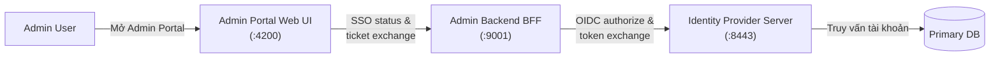

# Enterprise Diagram Styling & Architectural Semantics

Rules for visual clarity, professional banking aesthetics, and avoiding architectural anti-patterns.

---

## 1. Semantic Color Hygiene

Colors in enterprise architecture carry strict semantic meaning. Mixing semantics confuses auditors, architects, and engineers.

| Semantic Purpose | Recommended Fill | Recommended Stroke | When to Use |
|---|---|---|---|
| **Success / Pass** | `#ECFDF5` (Soft Emerald) | `#059669` | `AUTHENTICATED`, `SUCCESS`, Healthy nodes |
| **Pending / Warning** | `#FEF3C7` (Soft Amber) | `#D97706` | `AUTH_WAITING`, `PENDING`, Retries, Timeouts |
| **Error / Reject / Fail** | `#FFF1F2` (Soft Rose) | `#E11D48` | `REJECTED`, `CANCELLED`, `FAILED`, Exception handlers |
| **Ops / Management** | `#F8FAFC` (Slate) / `#ECFEFF` (Cyan) | `#64748B` / `#0891B2` | Admin consoles, Operations lanes, Management planes |
| **Core Runtime / System** | `#EFF6FF` (Soft Blue) | `#2563EB` | Production runtime nodes, backend services, gateways |

### Anti-Pattern: Red / Pink for Normal Operations
**Never** style Platform Ops, Admin Portals, or Management lanes with red or rose borders (`#FFF1F2` / `#E11D48`). Readers instantly perceive them as failed components or error states.
* **Bad:** `OpsLane: fill #FFF1F2, stroke #E11D48` (looks like an active alert/failure)
* **Good:** `OpsLane: fill #F8FAFC, stroke #64748B, stroke-dasharray: 5 5` (clean, distinct management plane)

---

## 2. Component Diagrams vs. Sequence Diagrams

### The Trap: Forcing Chronology into Component Diagrams
A component diagram (`flowchart` / `graph`) answers:
> **"Which components exist, what are their dependencies, and where are the trust boundaries?"**

It is **NOT** a sequence diagram.

### Anti-Pattern: Bidirectional Arrows with Multi-step Labels
```mermaid
%% BAD: Confusing bidirectional link with numbered chronology
PortalFE <-->|"[2] GET /sso/status & [7] Trả ticket"| PortalBE
```
* **Why it fails:** The reader cannot determine which action flows left-to-right versus right-to-left.

### Best Practice: Unidirectional Dependency Flow
Keep component links single-directional (`-->`) with clean protocol or responsibility labels:

* **Footnote convention:** Add a callout under the diagram:
  > *Chi tiết thứ tự request, authorization code, token và ticket xem Sơ đồ Tuần tự (Sequence Diagram).*

---

## 3. State Machine Aspect Ratios

In `stateDiagram-v2`, adding an excessively wide or tall `note` next to a terminal state compresses the entire state machine horizontally:
* States shrink and text becomes microscopic in portrait documents.
* Transition arrows bunch together into tight bundles.

### Rules for State Diagrams
1. Keep note boxes inside the diagram short (**under 3–4 lines**).
2. Use concise status labels directly on states:
   ```mermaid
   CONSUMED: CONSUMED (Target — Blocked by TBD-11)
   ```
3. Move full legal, regulatory, or governance exception narratives (e.g., G-WAIVE clauses) into Markdown callout blocks **directly beneath the diagram** rather than crowding the SVG/PNG canvas.

---

## 4. Zero Emojis in Enterprise Assets

Never include emoji characters (e.g., 🔒, ⚠️, 🚀, ❌, ✅) in Mermaid source code:
* Causes rendering glitches across headless Chromium versions and Linux font configurations.
* Violates formal banking and ISO technical documentation standards.
* Use clean text labels and semantic colors instead.
