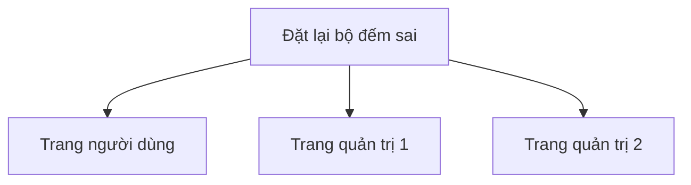
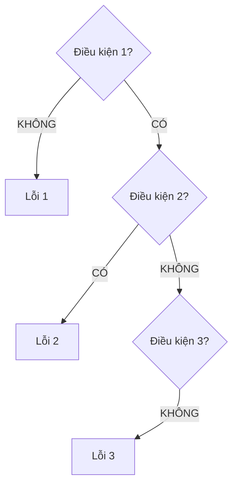
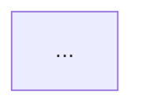
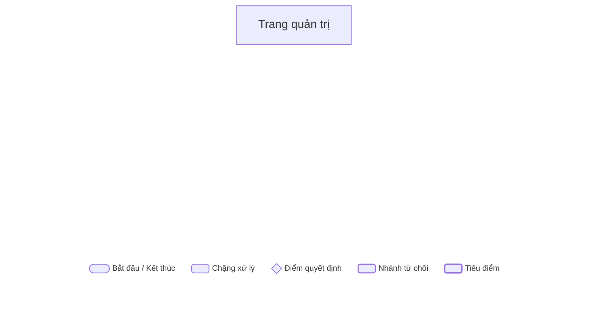

# Flowchart Optimization & Anti-Spaghetti Guide

Techniques for creating clean, compact, professional Mermaid flowcharts with `@mermaid-js/mermaid-cli` (`mmdc`), avoiding Dagre layout traps, and knowing when to use vector tools.

---

## 1. Root Causes of Flowchart "Spaghetti" in Mermaid

Mermaid uses **Dagre** (Sugiyama layered layout algorithm) by default. Unlike vector UI tools (Figma, Draw.io), Dagre has inherent limitations:
1. **No Bus Routing:** Cannot natively draw a single trunk line that splits into a horizontal bus with multiple drops (1-to-N). It draws $N$ separate curved splines leaving from different ports.
2. **Topological Re-ranking Traps:** Any feedback loop or return edge (e.g., Error 3 $\to$ Error 1) forces Dagre to recompute ranks, pushing unrelated nodes to the bottom and scrambling columns.
3. **Diamond Ballooning:** Mermaid scales diamond shapes (`{...}`) to enclose the diagonal bounding box of the text. Multi-line decision text expands diamonds to 150–200px, blowing up vertical height by 2.5–3x.

---

## 2. Technique 1: The Dummy Bus Bar (Trunk-and-Branch 1-to-N)

### Problem
Connecting 1 source node to 3 target nodes (`A --> B`, `A --> C`, `A --> D`) creates 3 separate curved lines spreading awkwardly across the canvas.

### Solution
Insert a zero-height horizontal dummy node `BUS` acting as a distribution bar:

```mermaid
%% GOOD: 1 trunk line into a horizontal bus bar with 3 clean vertical drops
flowchart TD
    classDef busBar fill:#334155,stroke:#334155,min-height:2px,height:2px;
    
    RESET["Đặt lại bộ đếm sai · tạo phiên"]
    
    %% Horizontal bus bar
    BUS["&nbsp;&nbsp;&nbsp;&nbsp;&nbsp;&nbsp;&nbsp;&nbsp;&nbsp;&nbsp;&nbsp;&nbsp;&nbsp;&nbsp;&nbsp;&nbsp;&nbsp;&nbsp;&nbsp;&nbsp;&nbsp;&nbsp;&nbsp;&nbsp;&nbsp;&nbsp;&nbsp;&nbsp;&nbsp;&nbsp;&nbsp;&nbsp;&nbsp;&nbsp;&nbsp;&nbsp;&nbsp;&nbsp;&nbsp;&nbsp;&nbsp;&nbsp;&nbsp;&nbsp;&nbsp;&nbsp;&nbsp;&nbsp;"]:::busBar
    style BUS fill:#334155,stroke:#334155,height:2px,max-height:2px,padding:0px

    RESET --- BUS
    BUS --> |NDT| P1["Trang người dùng"]
    BUS --> |QTN / QTDV| P2["Trang quản trị 1"]
    BUS --> |QTHT| P3["Trang quản trị 2"]
```





---

## 3. Technique 2: Strict Column Alignment & Constraint Locking

### Problem
Parallel columns (e.g., Decision Spine in center, Error Cards on the left) drift horizontally or get scrambled when cross-links exist.

### Solution: Invisible Ranking Chains
Lock parallel columns in vertical lockstep using invisible edges (`~~~`):



> [!WARNING]
> **Avoid Backward Edges Across Columns:** If `ERR3` must loop back to `ERR1`, adding `ERR3 --> ERR1` can cause Dagre to shove `ERR1` below `ERR3`. If rank scrambling occurs, use dotted edges (`ERR3 -.-> ERR1`) or document the return loop in the label rather than a raw cycle edge.

---

## 4. Technique 3: Slashing Diagram Bloat & Spacing

### 1. Compact Directive Header
Add init directives at the top of `.mmd` to override bloated defaults (default spacing is 50px):



* `rankSpacing: 25`: Reduces vertical distance between levels by 50%.
* `nodeSpacing: 20`: Keeps sibling nodes tight horizontally.
* `curve: "linear"`: Replaces messy rounded bezier curves with clean straight/orthogonal lines.

### 2. Taming Giant Diamonds
Wrap decision text into 1–2 tight lines and reduce font size via inline spans:

```mermaid
%% BAD: Creates massive 200px diamond
D{"Kiểm tra xem tài khoản này có còn tồn tại trong hệ thống và đang hoạt động hay không?"}

%% GOOD: Compact 90px diamond
D{"Tài khoản tồn tại<br/>và đang hoạt động?"}
```

---

## 5. Technique 4: Embedded Horizontal Legend (Thanh chú thích đáy)

### Problem
Mermaid has no native legend component. Placing shape nodes in a `subgraph` causes Dagre to stack them vertically or stretch the outer frame.

### Solution: Single Transparent Node with Inline SVG Table
Create an anchored footer node at the bottom with mini SVGs and fixed spacing:



---

## 6. Architectural Boundary: When to Bail Out of Mermaid

Recognize when requirements exceed Mermaid's engine capabilities:

| Requirement | Mermaid Feasibility | Recommended Tool |
|---|---|---|
| Logic flows, CI/CD pipelines, simple state branching | **Best** (Fast, code-based) | `mmdc` |
| 1-to-N bus branching, compact spacing | **Good** (With Dummy Bus Bar trick) | `mmdc` |
| Strict 2D multi-swimlane grid with return loops | **Poor** (Dagre scrambles ranks) | **Draw.io** (diagrams.net) |
| Enterprise BA / UI Kit flowcharts with exact pixel spacing | **Unsuitable** | **Figma / FigJam** |
| Automated pixel-perfect vector generation via code | **Unsuitable** | **Custom SVG generator** (Python/Node) |

> [!TIP]
> **Rule of Thumb:** If you spend more than 10 minutes fighting Dagre edge routing or node ranks, stop trying to bend Mermaid into a vector design tool. Use Draw.io for manual authoring, or generate standalone SVG for automated pipelines.
