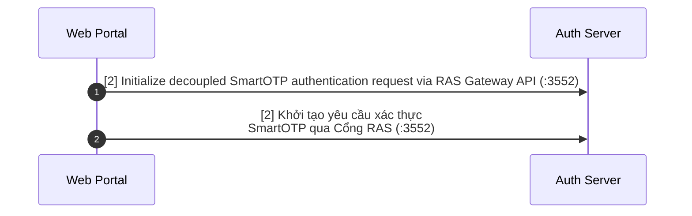

# Sequence Diagram Optimization Guide

Guidelines for creating clean, readable, professional Mermaid sequence diagrams with `@mermaid-js/mermaid-cli` (`mmdc`).

---

## 1. Preventing Actor Text Overflow

Mermaid calculates participant box width based on text length. Long labels without line breaks create wide boxes that push lifelines apart or clip at viewport edges.

### Rule
Break participant labels with `<br/>` every **15–20 characters** or at logical syntactic boundaries:

```mermaid
%% BAD: Creates an excessively wide actor box
participant Browser as Customer Web Browser (Internet Banking Portal)
participant IdP as Identity Provider Server (:8443 Runtime Node)

%% GOOD: Compact, balanced actor boxes
participant Browser as Customer Web Browser<br/>(Internet Banking)
participant IdP as Identity Provider Server<br/>(:8443)
```

---

## 2. Eliminating Massive Lifeline Gaps

### The Root Cause
When an arrow message between two lifelines has a long horizontal string on a single line, Mermaid stretches the distance between those two lifelines across the entire width of that string. In dense diagrams, this can create massive 1000px+ gaps of blank space across unrelated lifelines.

### The Fix: Multi-line Label Wrapping
Break message strings into **2 to 3 compact lines** using `<br/>`:



---

## 3. Note Box Text Overflow & Multi-Actor Spanning

### Problem
A note placed over a single actor (`Note over A: ...`) has a narrow width bounded by that actor's lifeline. Long prose inside it either overflows the boundary or wraps into a tall, ugly vertical column.

### Fix 1: Wrap Note Text
Insert `<br/>` every **30–45 characters**:
```mermaid
Note over IdP: Kiểm tra vé một lần (single-use)<br/>qua mã ủy quyền trong RAM cache
```

### Fix 2: Span Note Across Multiple Actors
When a note describes an interaction or shared context, span it across adjacent lifelines:
```mermaid
%% Spans across User and Browser to create a naturally wide, readable note
Note over User,Browser: [2. Nhận thông báo đẩy và xác thực SoftOTP]<br/>Người dùng mở ứng dụng và xác nhận giao dịch
```

---

## 4. Arrow Types & Chronological Flow

Never use bidirectional arrows (`<-->`) in sequence diagrams. Every message must be a distinct directional step:

| Arrow | Meaning | Use Case |
|---|---|---|
| `->>` | Synchronous call / Request | HTTP Request, RPC, Method invocation |
| `-->>` | Return / Response | HTTP Response, return value |
| `-)` | Asynchronous message | Queue message, webhook, push notification |
| `--x` | Failed delivery / Abort | Timeout, connection refused, rejection |

Always pair request `->>` with response `-->>` if the caller blocks on the result.
