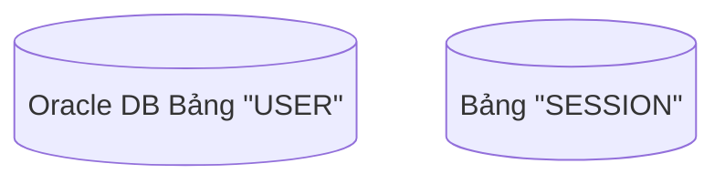
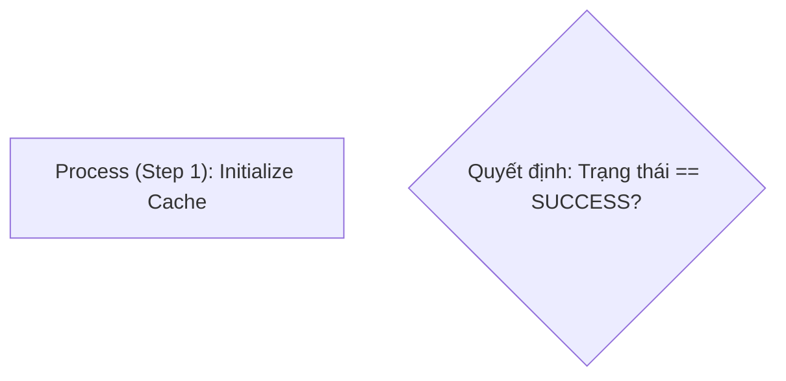

# Mermaid Syntax & Character Escaping Reference

Avoid parse errors, truncated labels, and render failures caused by special characters in Mermaid definitions.

---

## 1. The `#` Character Trap (`#35;`)

Mermaid's lexer treats the hash character (`#`) as the start of a hex color code (e.g., `#FFFFFF`) or a reserved styling directive. Using raw `#` inside labels will cause **fatal syntax errors** or **silent text truncation**:

```mermaid
%% BROKEN: Parser error or truncated text
Browser->>Backend: GET /auth/callback#ticket=ST-123456
state "State #1: CREATED" as S1
```

### The Solution: Numeric HTML Entity `#35;`
Always replace `#` in labels, URLs, IDs, and tickets with `#35;`:

```mermaid
%% CORRECT: Renders '#ticket=ST-123456' cleanly
Browser->>Backend: GET /auth/callback#35;ticket=ST-123456
state "State #35;1: CREATED" as S1
```

---

## 2. Double Quotes & String Delimiters

When displaying literal quotation marks inside node labels or sequence messages:
* Use `&quot;` or `#34;`.
* Wrap the entire label string in double quotes:



---

## 3. Comparison Operators (`<`, `>`, `<=`, `>=`)

Raw `<` and `>` characters conflict with Mermaid's HTML label parser and arrow lexer.
* Replace `<` with `&lt;`
* Replace `>` with `&gt;`
* Replace `<=` with `&lt;=`
* Replace `>=` with `&gt;=`

```mermaid
%% Sequence note checking TTL
Note over Server: Kiểm tra: Thời gian sống &lt;= 180s
```

---

## 4. Flowchart Node Shapes with Special Characters

Flowcharts use `()`, `[]`, `{}`, and `(())` as structural node boundary delimiters. If your label text contains parentheses, brackets, or colons, **always quote the entire label**:



---

## 5. Summary Cheat Sheet

| Literal Character | Safe Entity in Mermaid | Typical Context |
|---|---|---|
| `#` | `#35;` | URL hash fragments (`#35;ticket=...`), IDs (`#35;1`), column hashes |
| `"` | `&quot;` or `#34;` | Quoted table names (`&quot;USER&quot;`), string literals |
| `<` | `&lt;` | Comparisons (`TTL &lt; 180s`), generic types |
| `>` | `&gt;` | Comparisons (`count &gt; 0`), redirects |
| `&` | `&amp;` | Query strings, boolean logic (`&amp;&amp;`) |
